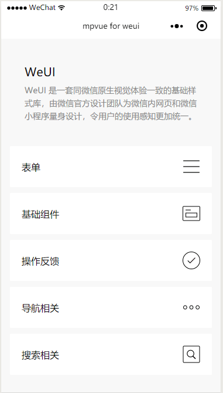
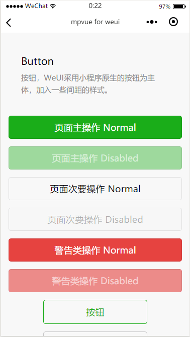
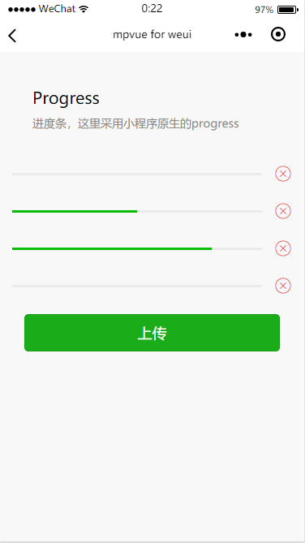
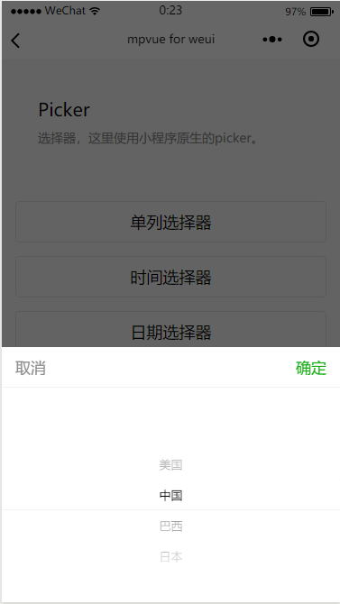

# mpvue-weui

> 用 vue 写小程序，使用 mpvue 框架重写 WeUI。

> 基于小程序原生组件，开发高效快捷。

## 前言

今天早上打开电脑，像往常一样浏览一下 `github`，看到了一个很不错的框架，没错，就是 [mpvue](https://github.com/Meituan-Dianping/mpvue)。它是基于 `Vue.js` 的小程序开发框架，从底层支持 `Vue.js` 语法和构建工具体系。what，小程序可以用 `vue`写了？简直有点不太敢确定，花了[5分钟](http://mpvue.com/mpvue/quickstart/)看了一下简介，没错，真的可以用`vue`开发小程序。真的是**限制了我的想象力，明白又该学写了，于是就开始准备利用这个框架写一点项目，感受一下他的魅力(其实是踩坑)。


## mpvue-weui 是什么

也许 `mpvue-weui` 的内容不像它的名字那么高大上，它不是一个`UI`库（原谅我霸占了这么好的名字:zap:），其实它就是一个 `WeUI`的 demo 库，就像 [WeUI](https://weui.io/)一样，只不过是在 `mpvue` 框架下重写了一下。


## 该文档的目的

其实 `mpvue` 框架对小程序的原生组件支持地非常好，但对于一些新人来说，比如我，在开始接触`mpvue` 的时候由于不太了解。就造成了对于在小程序中的一些方法不知在 `mpvue` 如何实现。举一个简单的例子：小程序 `picker`组件有一个`bindchange`属性，刚开始时我完全将这个属性移植到了 `mpvue`中，发现并不能用，waht，这岂不是很尴尬。然后就问了一下大佬[anchengjian](https://github.com/anchengjian),得知在 `mpvue` 框架下要写成 `@change`,这样问题就解决了。因此这篇文档的主要作用就是将自己踩的一些坑记录下来，然后在说下在 `mpvue` 框架下如何使用 `WeUI`。

?> [anchengjian](https://github.com/anchengjian)    :heart:    [aOrz](https://github.com/aOrz) 为  `mpvue` 开发者。没错，就两个人写了一个框架。


## 开发预览

``` bash
1. git clone
git clone https://github.com/KuangPF/wxapp-vue.git

2. 安装依赖
npm install (cnpm install)

3. 启动程序
npm run dev

4. 预览
打开微信开发者工具，新建项目，将目录指向 /dist 即可

```
## 效果







